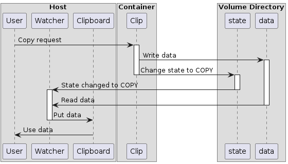
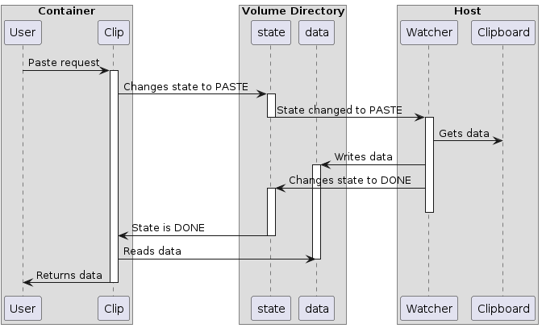

# Docker clipboard dispatcher

Uses docker volume to share data between the container and the host.

## Installation

Install python in your container, and copy/clone this repo to it. Install it
using `clipdis_setup.py`. Add `CLIPDIS_DIRECTORY` environment variable with the
path, where the volume will be mounted. On a host just clone this repo and
install it.

```sh
git clone https://github.com/edKotinsky/clipdis.git
python3 clipdis_setup.py -i (host|container) [-e]
```

`clipdis_setup.py` dynamically generates `pyproject.toml` file for chosen
installation type and invokes `pip install`.

`-i` option specifies the type of installation. When module installed on a host
side, it provides the `clipdis_start` command, which starts your docker
container and watches the specified clipboard directory. When module installed
in container, it provides a bunch of commands: `c`, `p`, `xclip`, `pb-paste`,
etc., which are actually the wrappers for the module.

`-e` option installs module in develop mode.

After module installed on a host, it provides `clipdis_start` command.
It may be useful to add the following alias to bashrc:

```sh
alias clipdis="clipdis_start -D <cvolume> -d <hvolume> -- <options-to-docker>"
```

The hvolume here is a path to directory on a host, where the volume will be
mounted, and cvolume is a path to directory in a container.

Clipdis will start container with the following arguments:

```python
docker_cmd = ["docker", "run", "--interactive", "--tty",
              "--name", containername,
              "--volume", f"{hvolume}:{cvolume}",
              *args]
```

You should not specify these options again.

## How it works

It acts like an initializer and background watcher on a host side and mimics
the actual clipboard tools on a container side.

When clipdis started on a host side, it starts background watcher first,
then executes docker command, which replaces it. When the docker container
exited, watcher exits too. Watcher monitors files in a clipboard directory,
where container's clipboard volume is mounted, and performs reading/writing
between host's clipboard and these files.

On a container side module provides commands `xsel`, `xclip`, `wl-copy`,
`wl-paste`, `pb-copy`, `pb-paste`, which actually are links to clipdis.

There are two files: `.state` for storing the state and `.data` to store the
data respectively. Possible states are: PASTE, when the container's tool
requests data from host's clipboard; COPY, when the container's tool
sends data from stdin to host's clipboard; DONE, when the watcher puts data
into `.data` file; and NONE, which means "no operation". State is required to
manage access to `.data` file, to avoid race and data overwriting.

Currently, clipdis requires container name to keep track of a container. Watcher
periodically asks docker: "is there a container with this name in your list?",
and if not - it exits. By default, container name is `hello_world`, and it can
be changed by passing option `-n|--containername`.

### Copy from Container to Host



### Paste from Host to Container



## Disclaimer

I don't know, will this work on Windows.

## License

Licensed under MIT License.
