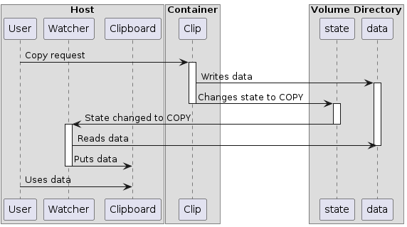

# Docker clipboard dispatcher

Uses docker volume to share data between container and host. Possibly will work
even on Windows (but I have not tested).

## How it works

There are two parts: clipboard tool and watcher. 

Tool is a container's part.
It mimics the real clipboard tools as xsel, xclip, wl-copy, etc. It just reads
and writes data from the file, that is placed into the volume's directory,
into the standard input/output. It requires the name of a tool to determine an
operation to perform: copy or paste.

Watcher is a part that is run on a host's side. When it starts, it creates an 
orphaned process, that monitors the files in the container's volume directory,
and reads/writes data between the host's clipboard and files in the directory.
It requires the container's ID to check, if the container is alive. If not, then
the process exits. 

### Copy from the Container to a Host

### Paste from Host to a Container

## Disclaimer

I wrote this thing not so soon, so it is quite raw and buggy.

## License

Licensed under MIT License.
